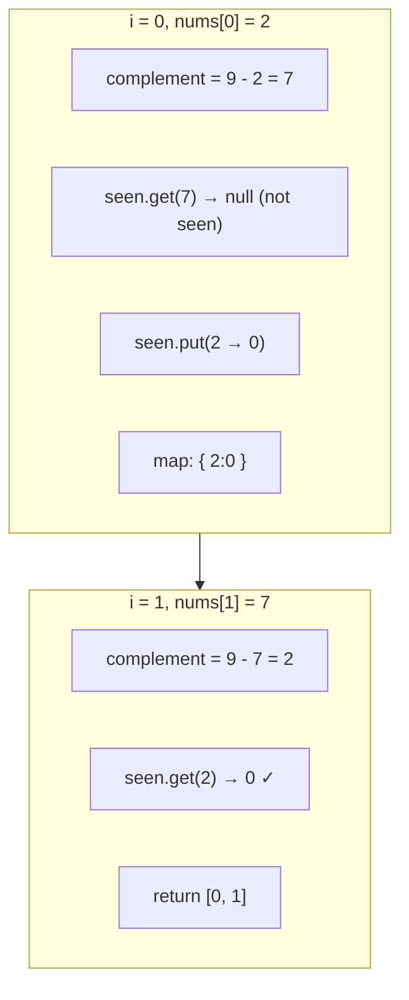

# HashMap + Two Sum — one loop walkthrough

**Problem:** `nums = [2, 7, 11, 15]`, `target = 9`  
**Map meaning:** `key` = number we saw, `value` = its index

---

## The idea in one sentence

At each index `i`, ask: **“Did I already see `target - nums[i]`?”**  
If yes → return that old index and `i`. If no → remember `nums[i]` at index `i`.

---

## Diagram (each step of the loop)



ASCII version (same story):

```
target = 9

i=0  nums[0]=2   need 7   map: {}           get(7)=null  →  put(2→0)   map: {2:0}
i=1  nums[1]=7   need 2   map: {2:0}       get(2)=0     →  DONE [0,1]
```

We never need `i=2` or `i=3` because we already returned.

---

## Line-by-line ↔ code

| Step | What happens | Code |
|------|----------------|------|
| Create empty map | “Memory of past numbers” | `HashMap<Integer,Integer> seen = new HashMap<>()` |
| Walk array | One pass, left to right | `for (int i = 0; i < nums.length; i++)` |
| What we need now | Pair for `nums[i]` | `int complement = target - nums[i]` |
| Already seen? | Lookup by **value**, not index | `Integer index = seen.get(complement)` |
| Found pair | Old index + current | `if (index != null) return new int[]{index, i}` |
| Not yet | Store current for later | `seen.put(nums[i], i)` |

---

## Why `Integer` and `null`?

- `get(missingKey)` returns **`null`**, not `-1`.
- So we use `Integer index` and check `index != null`.
- Primitives (`int`) cannot be `null` — that’s why the map uses `Integer` for values.

---

## Complexity

| | |
|---|---|
| Time | O(n) — each element: one `get`, one `put` |
| Space | O(n) — map holds up to n entries |

---

## Runnable trace

Run: `./run 11_HashMapTwoSumWalkthrough.java` (from `dsa/basics`)  
Or open that file and use **Cmd+Shift+B** → **▶ Run Java file**.
